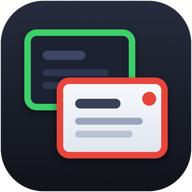
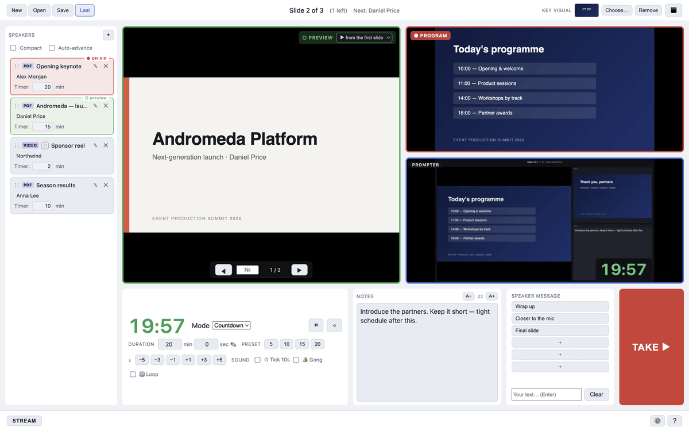
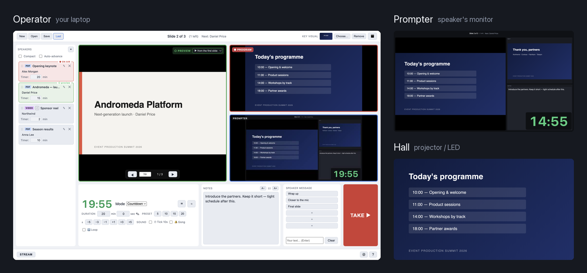
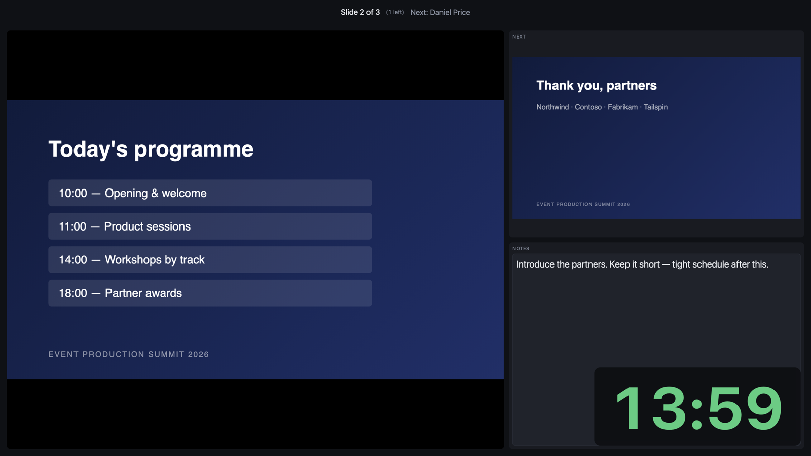
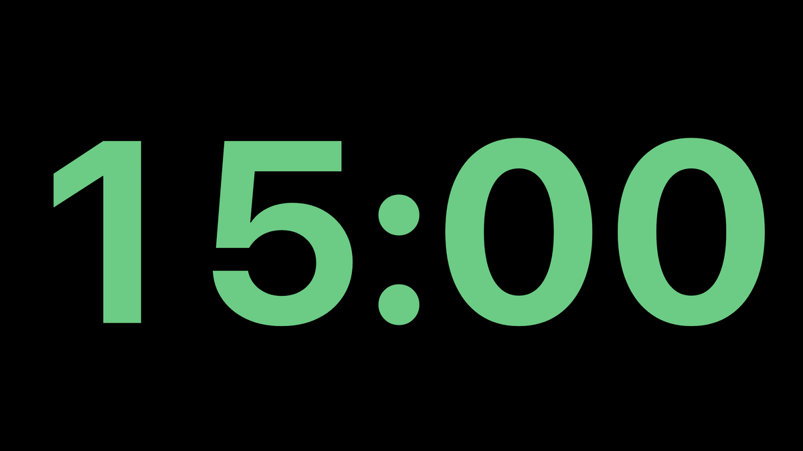
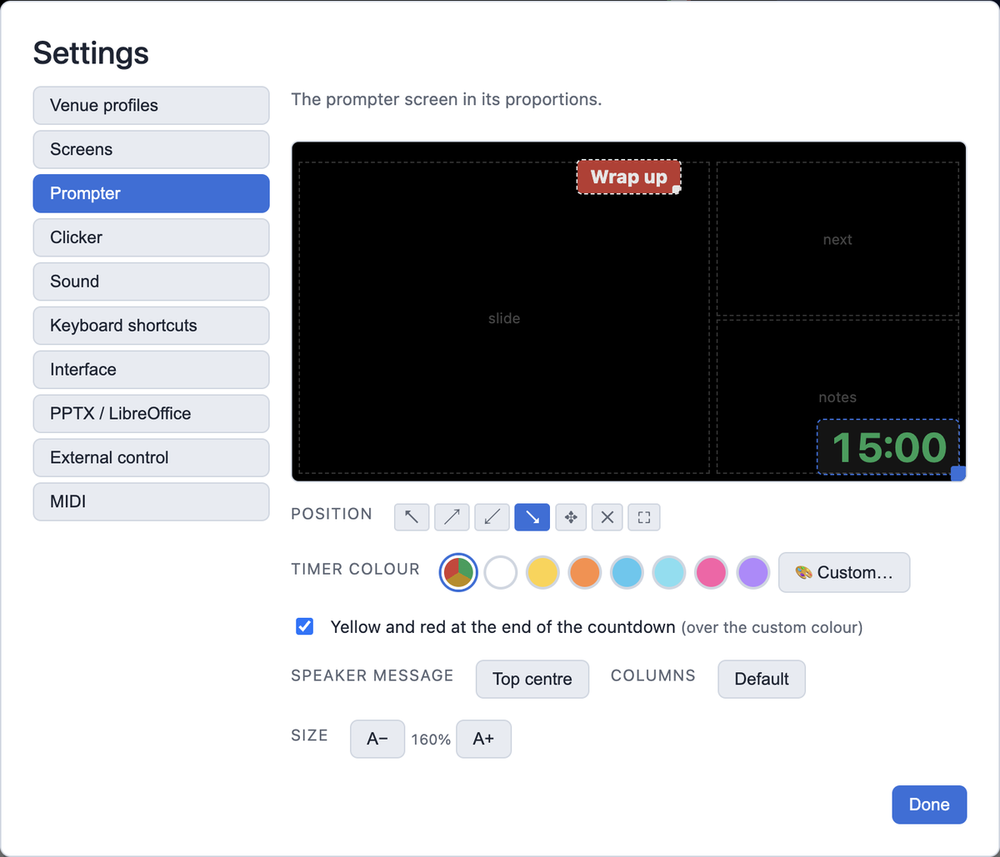
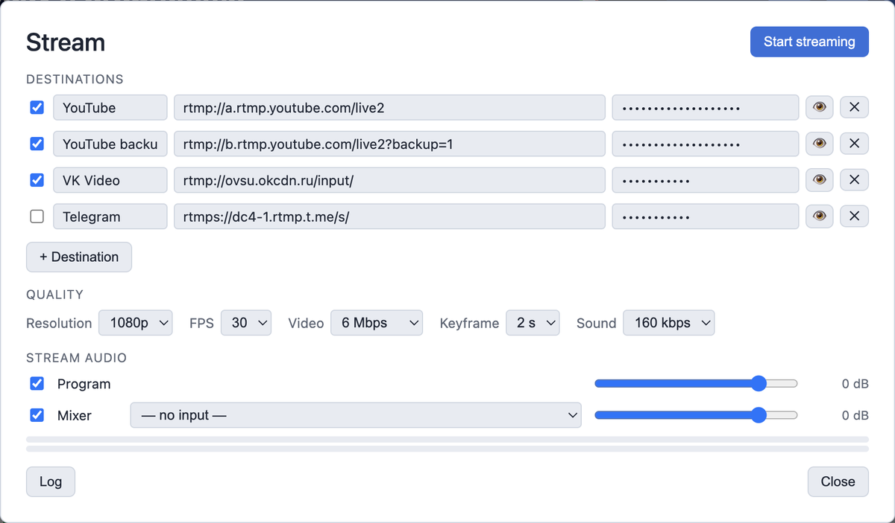
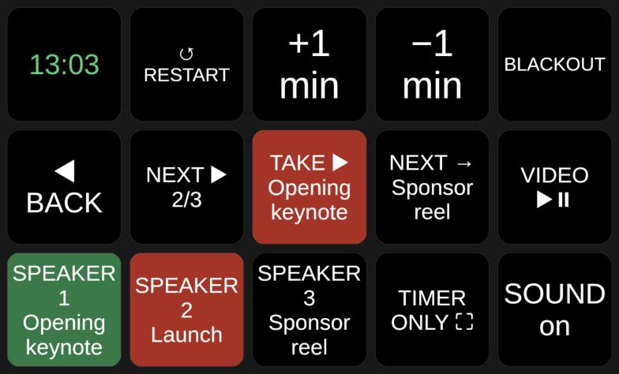

<p align="center"></p>

<h1 align="center">CueDeck</h1>

<p align="center"><b>Every speaker's slides from one seat: preview, TAKE, timers, prompter, streaming.</b><br>
Free · macOS &amp; Windows · for live events and conferences</p>

<p align="center">
<a href="https://github.com/ttpa3dhuk/CueDeck/releases/latest"><b>Download</b></a> ·
<a href="README.ru.md">Русская версия</a> ·
<a href="CHANGELOG.md">What's new</a> ·
<a href="https://www.youtube.com/watch?v=Vi5BDG_WoRg">Video</a>
</p>



Line up every speaker beforehand: PDF, PowerPoint, Keynote, video, a guest laptop. Stage the next one in Preview and press TAKE. It goes to the hall, their timer is loaded, the prompter follows.

## Three screens, one operator



## A prompter speakers actually read

Current and next slide, your notes in real time, a timer that turns yellow and red. Or give the whole screen to the timer and feed it to a stage monitor.

| | |
|---|---|
|  |  |

Drag the timer and messages wherever you want them:



## Stream without OBS

The STREAM button sends the hall picture and sound to YouTube, VK and Telegram, up to 5 destinations at once. You can add or drop one while live. Stats show whether a problem is your computer, the network or the platform.



## OMT outputs for vMix and OBS

The timer on a transparent background, the hall (with sound) and the prompter go out as network sources over [OMT](https://github.com/openmediatransport), the open alternative to NDI. vMix 29+ sees them natively, OBS needs the OMT plugin. The timer lands on top of your picture with no keying. When vMix takes a CueDeck source to program, the OMT button turns red.

Set it up in Settings → OMT outputs (name, 720p / 1080p / 4K, 15–60 fps). Use a wired network for video: each receiver gets its own stream, about 60 Mbit/s at 1080p30. Over Wi-Fi we got 11 frames out of 30.

We haven't tested live vMix 29 yet, only OBS. If something goes wrong in vMix, [open an issue](https://github.com/ttpa3dhuk/CueDeck/issues/new/choose).

## Stream Deck and Companion

A ready-made [Bitfocus Companion](https://bitfocus.io/companion) page: live timer, TAKE with the speaker's name, speakers lit green for preview and red on air. HTTP and OSC cover everything else ([setup](companion/README.md)).



## Download

| Computer | File from [the latest release](https://github.com/ttpa3dhuk/CueDeck/releases/latest) |
|---|---|
| Mac with Apple Silicon (M1 and later) | `CueDeck-<version>-Silicon-mac.zip` |
| Mac with Intel | `CueDeck-<version>-Intel-mac.zip` |
| Windows 10 / 11 | `CueDeck-<version>-win.zip` |

<details>
<summary>First launch: the app isn't signed</summary>

On macOS: unzip, drag `CueDeck.app` to Applications, then right-click, "Open", and "Open" again. If macOS says the app is damaged: `xattr -cr /Applications/CueDeck.app`.

On Windows: unzip and run `CueDeck.exe`. SmartScreen will warn: click "More info", then "Run anyway". Still won't start? See [Windows: step by step](docs/windows.md).

PowerPoint and Keynote files need [LibreOffice](https://www.libreoffice.org/download/download-libreoffice/). PDF, images and video work without it.
</details>

<a href="https://www.youtube.com/watch?v=Vi5BDG_WoRg"></a><br>
<sub>Full walkthrough, 40 min (in Russian)</sub>

## More

<details>
<summary>All features</summary>

- Preview and Program, TAKE on `Tab`. Global clicker: PgUp/PgDn work even when CueDeck isn't focused
- Speaker playlist: drag-and-drop, a name and a timer per speaker
- Timer: countdown, stopwatch or clock. Presets and ±1 min on the fly, tick and gong sounds
- Notes reach the prompter in real time, PowerPoint speaker notes come in automatically
- Message to the speaker: "Wrap up", "Closer to the mic" or your own text
- Blackout / key visual (`B`): a still or looping video in the hall while you change files
- PowerPoint, Keynote, ODP: embedded videos and on-click animations play
- Videos synced across windows, per-clip loop, hold on first frame
- Photo and video lists as one playlist row, loop or shuffle with crossfade
- Live input: a guest laptop through a USB HDMI capture card joins the playlist like any file
- Audio: separate outputs for the hall and headphone cue/solo, level meters
- Streaming: RTMP/RTMPS, up to 5 destinations, a log file for every broadcast
- Stream Deck, Companion, OSC, HTTP, MIDI controllers
- Venue profiles: every setting for a known venue in one pick
- Projects move between computers, missing files are flagged when you open the project, not on air
- Quit confirmation mid-show. Help → Report a problem saves a zip with logs
- English and Russian interface
</details>

<details>
<summary>Formats and devices</summary>

| What | Works | Note |
|---|---|---|
| PDF, PNG, JPG, WebP, GIF, BMP | yes | opens instantly |
| PPTX, PPT, ODP, Keynote | yes | converted once via LibreOffice, then cached. Exit effects and transitions don't play |
| Video H.264 + AAC (MP4, MOV, M4V), WebM | yes | MP4 (H.264 + AAC) is the safest |
| HEVC / H.265 | partly | usually fine on Mac, Windows needs HEVC Video Extensions |
| ProRes, DNxHD | no | transcode with [HandBrake](https://handbrake.fr/) |
| USB capture (UVC): Elgato Cam Link, AVMatrix, ATEM Mini, webcams | yes | if Photo Booth / Camera sees it, CueDeck will |
| Blackmagic DeckLink / UltraStudio | no | own driver, not visible as a camera |
</details>

<details>
<summary>Keyboard</summary>

Remap in Settings → Keyboard shortcuts.

| Key | Action |
|---|---|
| `Tab` | TAKE: send preview to the hall |
| `←` `→` / `Space` / `PgUp` `PgDn` | Program: previous / next slide |
| `[` `]` | Preview: previous / next slide |
| `B` | Blackout / key visual |
| `T` / `R` | Timer start-pause / reset |
| `Cmd+,` | Settings |
</details>

<details>
<summary>Build from source</summary>

```bash
git clone https://github.com/ttpa3dhuk/CueDeck.git
cd CueDeck
npm install
npm run dev           # development mode
npm test              # tests
npm run package:mac   # Mac zips (Apple Silicon + Intel)
npm run package:win   # Windows zip
```

Electron + TypeScript.
</details>

Found a bug? [Open an issue](https://github.com/ttpa3dhuk/CueDeck/issues/new/choose). Help → Report a problem saves a zip with logs you can attach.

CueDeck is free and built in spare time. If it saved your show, you can [buy me a coffee](https://pay.cloudtips.ru/p/b79fa042).

[MIT](LICENSE) © 2026 [Azat Khusaenov](https://github.com/ttpa3dhuk)
