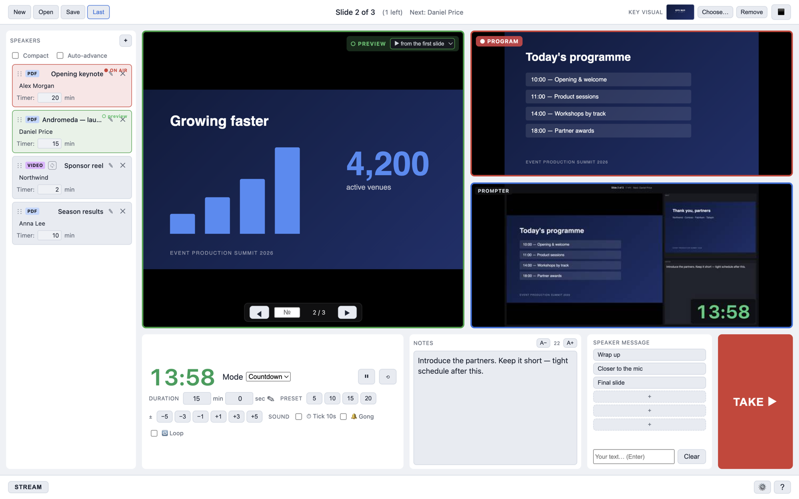

# CueDeck

[](https://github.com/ttpa3dhuk/CueDeck/releases/latest)
[](https://github.com/ttpa3dhuk/CueDeck/releases/latest)
[](https://github.com/ttpa3dhuk/CueDeck/releases/latest)
[](LICENSE)

**Презентации всех спикеров мероприятия с одного рабочего места — превью/эфир как на видеопульте, таймер на каждого, суфлёр с заметками.**

🇬🇧 [English](README.md) · 📋 [Что нового](CHANGELOG.md) · ⬇️ [Скачать](https://github.com/ttpa3dhuk/CueDeck/releases/latest)



## 💡 Зачем

Каждый спикер приносит своё — PDF, PowerPoint, Keynote, ролик, собственный ноутбук. Переключать надо быстро, держать каждого в регламенте и подсказывать так, чтобы зал не видел. Режим докладчика PowerPoint держит одну презентацию, PDF-просмотрщик не умеет ни таймер, ни заметки.

CueDeck устроен как видеопульт: заранее собираешь всех спикеров в плейлист, следующего готовишь в **превью**, жмёшь **TAKE** — он уходит в зал. Окно «Открыть файл» на экране зала не появится никогда.

## ✨ Возможности

**🎛 Эфир**
- **Превью / эфир** и **TAKE** (`Tab`) — следующий файл готовишь незаметно, текущий в зале не прерывается
- Три окна на три экрана: **оператор**, **суфлёр** (слайд + следующий + заметки + таймер), **зал** (только слайд)
- **Заставка / blackout** (`B`) — зал видит картинку или видео-заставку, пока меняешь файлы
- Глобальный кликер — PgUp/PgDn листают, даже когда CueDeck не в фокусе

**🗣 Спикеры**
- **Плейлист спикеров** — перетаскивание, имя и таймер на каждого
- **Таймер** — обратный отсчёт с пресетами и ±1 мин на лету, секундомер или часы; на суфлёре — куда угодно мышкой или во весь экран под отдельный монитор
- **Заметки → суфлёр** мгновенно; заметки докладчика из PowerPoint подставляются сами
- Сообщение спикеру: «Заканчивайте», «Ближе к микрофону» или свой текст

**🎞 Материалы**
- PDF, картинки, **PowerPoint / Keynote / ODP** (через LibreOffice) — видео внутри слайдов и анимации «по клику» играют
- **Ролики** в плейлисте, синхронно во всех окнах; цикл у каждого, стоп на первом кадре
- **Списки фото/роликов** — одной строкой плейлиста, по кругу или вперемешку, с наплывом
- **Живой вход** — ноутбук гостя через USB-капчер HDMI встаёт в плейлист как обычный файл
- Отдельные выходы звука для зала и для **предпрослушки** в наушники, индикаторы уровня

**📡 Трансляция и управление**
- **Встроенная трансляция** — кнопка STREAM отправляет картинку и звук зала на YouTube, VK, Telegram, до 5 площадок разом (RTMP/RTMPS), без OBS
- **Stream Deck, Bitfocus Companion, OSC** — готовая страница Companion с живым таймером на кнопке ([как подключить](companion/README.md))
- MIDI-контроллеры

**🛟 Подготовка и страховка**
- **Профили площадки** — все настройки под знакомый зал одним выбором
- Проект переезжает на другой компьютер целиком; пропавшие файлы видны при открытии, а не в эфире
- Подтверждение при закрытии посреди шоу, отчёт о проблеме для тестеров (Справка → «Сообщить о проблеме…»)


## ⬇️ Скачать и установить

Последняя версия — **[GitHub Releases](https://github.com/ttpa3dhuk/CueDeck/releases/latest)**.

| Компьютер | Файл |
|---|---|
| Mac на Apple Silicon (M1 и новее) | `CueDeck-<версия>-Silicon-mac.zip` |
| Mac на Intel | `CueDeck-<версия>-Intel-mac.zip` |
| Windows 10 / 11 | `CueDeck-<версия>-win.zip` |

**macOS:** распакуй и перетащи `CueDeck.app` в «Программы». Приложение не нотаризовано, поэтому первый запуск — правый клик → **Открыть** → **Открыть**. Если пишет «приложение повреждено»: `xattr -cr /Applications/CueDeck.app`.

**Windows:** распакуй и запусти `CueDeck.exe`. SmartScreen предупредит → **Подробнее** → **Выполнить в любом случае**.

Для **PowerPoint / Keynote** нужен [LibreOffice](https://ru.libreoffice.org/download/). PDF, картинки и видео работают без него.

🎥 [Видеообзор всех возможностей, 40 мин](https://www.youtube.com/watch?v=Vi5BDG_WoRg)

## 📄 Форматы и устройства

| Что | Работает | Заметка |
|---|---|---|
| PDF, PNG, JPG, WebP, GIF, BMP | ✅ | открывается сразу |
| PPTX, PPT, ODP, Keynote | ✅ | конвертируется через LibreOffice один раз, дальше из кеша; эффекты исчезновения и переходы не играют |
| Видео H.264 + AAC (MP4, MOV, M4V), WebM | ✅ | гони в MP4 (H.264 + AAC) |
| HEVC / H.265 | ⚠️ | Mac — обычно да; Windows — нужны HEVC Video Extensions |
| ProRes, DNxHD | ❌ | перекодируй в [HandBrake](https://handbrake.fr/) |
| USB-захват (UVC): Elgato Cam Link, AVMatrix, ATEM Mini, веб-камеры | ✅ | видит Photo Booth — увидит и CueDeck |
| Blackmagic DeckLink / UltraStudio | ❌ | свой драйвер, камерой не видны |

## ⌨️ Клавиши

По умолчанию; переназначаются в ⚙️ Настройки → Горячие клавиши.

| Клавиша | Действие |
|---|---|
| `Tab` | **TAKE** — превью в зал |
| `←` `→` / `Space` / `PgUp` `PgDn` | Эфир: предыдущий / следующий слайд |
| `[` `]` | Превью: предыдущий / следующий слайд |
| `B` | Заставка / blackout |
| `T` / `R` | Таймер: старт-пауза / сброс |
| `Cmd+,` | Настройки |

## 🎛 Stream Deck и Companion

⚙️ Настройки → **Внешнее управление** → включить. **Список команд…** открывает страницу со всеми командами — готовые адреса с кнопкой «копировать» (HTTP — порт 9420, OSC — 9421). Для Bitfocus Companion есть готовая страница: Настройки → **Страница Companion…** → импортировать в Companion. Пошагово — [companion/README.md](companion/README.md).

## 🔧 Сборка из исходников

```bash
git clone https://github.com/ttpa3dhuk/CueDeck.git
cd CueDeck
npm install
npm run dev           # режим разработки
npm test              # тесты
npm run package:mac   # zip для Mac (Apple Silicon + Intel)
npm run package:win   # zip для Windows
```

Electron + TypeScript. Нашёл баг — [заведи issue](https://github.com/ttpa3dhuk/CueDeck/issues/new/choose); Справка → «Сообщить о проблеме…» сохраняет zip с журналом, его можно приложить.

## ☕ Поддержать

CueDeck бесплатный и делается в свободное время. Если выручил на шоу — [на кофе через CloudTips](https://pay.cloudtips.ru/p/b79fa042).

## 📄 Лицензия

[MIT](LICENSE) © 2026 [Азат Хусаенов](https://github.com/ttpa3dhuk)
